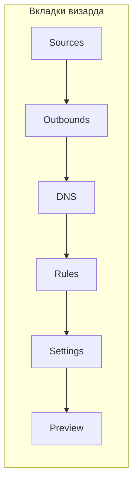
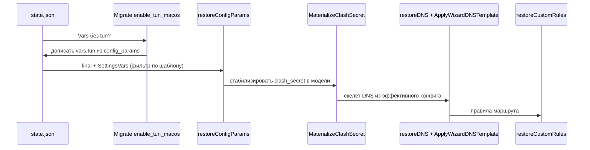
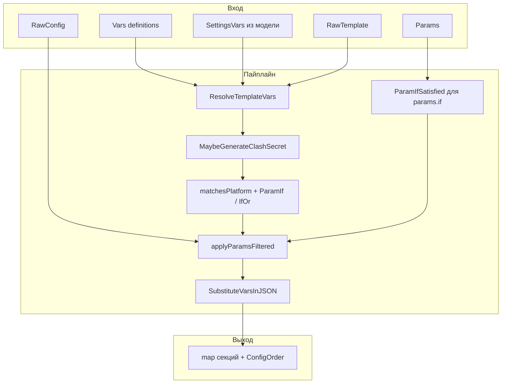
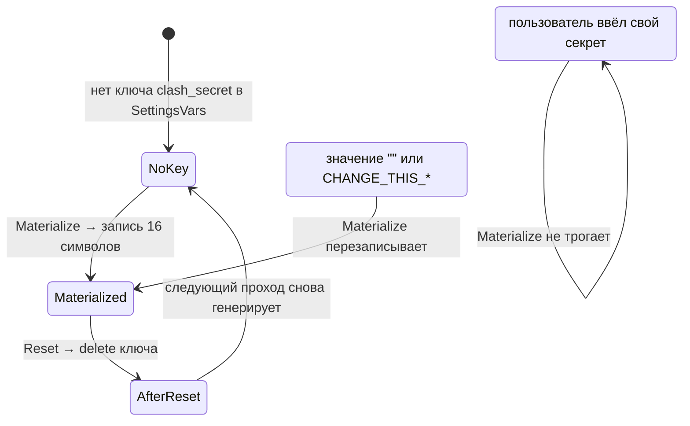
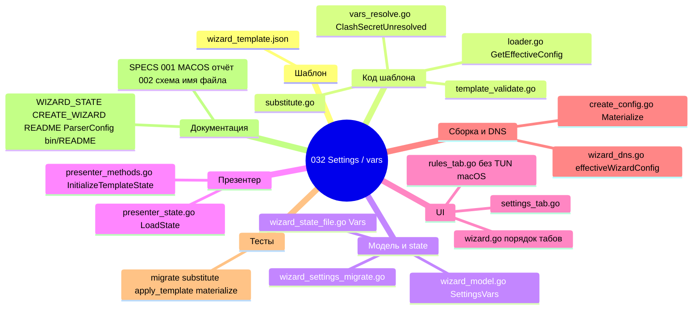

# Визард «Настройки» и переменные шаблона — итоговый отчёт

> **Задача:** `032-F-C-WIZARD_SETTINGS_TAB`  
> **Назначение документа:** один файл, чтобы вернуться к проекту и быстро вспомнить *что сделано*, *почему так*, *где лежит код* — с диаграммами и примерами.  
> **Краткая выжимка:** вкладка **Settings**, секция **`vars`** в `wizard_template.json`, подстановки **`@`**, условные **`params`**, перенос TUN с macOS с **Rules** сюда, стабильный **`clash_secret`**, миграция старого state, документация и тесты.

---

## TL;DR

| Было | Стало |
|------|--------|
| Часть полей только в JSON шаблона, TUN macOS — галочка на **Rules** (`enable_tun_macos`) | Явные переменные **`vars`**, редактируемые на **Settings**; в state — **`vars`**; старый флаг мигрирует в **`tun`** |
| Подстановка `@` могла не сработать при пустом массиве **`params`** | **`GetEffectiveConfig`** если есть **`Vars`** *или* **`Params`** (и непустой **`RawConfig`**) |
| Превью могло «мешать» новый **`clash_secret`** на каждый пересчёт | **`MaterializeClashSecretIfNeeded`** + уточнение для плейсхолдера/пустого значения в state (**`ClashSecretUnresolved`**) |
| В EN есть гайд по **`vars`**, в RU — пропуск | В **`docs/CREATE_WIZARD_TEMPLATE_RU.md`** добавлен полный раздел |
| В доках устаревшее имя **`config_template.json`** | В пользовательских гайдах и README — **`wizard_template.json`** |
| Неочевидно: **`state.vars["tun"]="true"`** на Linux | Для **`params.if` / `if_or`** сначала **`VarAppliesOnGOOS`**: переменная не для текущей ОС → **false**, независимо от state; задокументировано в SPEC / CREATE_WIZARD / WIZARD_STATE / ARCHITECTURE, тесты **`vars_resolve_test.go`** |

Лаконичный чеклист для релиза и путей к файлам — в **`IMPLEMENTATION_REPORT.md`** в этой же папке.

---

## 1. Порядок вкладок и роль Settings

Визард теперь ведёт пользователя так: сначала источники и правила, затем **системные** параметры шаблона, потом превью.



**Решение:** TUN на macOS — не «ещё одно правило маршрута», а настройка окружения; она логичнее соседствует с портом mixed, уровнем лога и Clash API.

---

## 2. Данные: шаблон и state

### 2.1. Фрагмент идеи в `wizard_template.json`

Объявления переменных и использование в конфиге (упрощённо):

```json
{
  "vars": [
    {
      "name": "tun",
      "type": "bool",
      "platforms": ["darwin"],
      "default_value": "false",
      "comment": "TUN (macOS)"
    },
    {
      "name": "clash_secret",
      "type": "text",
      "default_value": "CHANGE_THIS_TO_YOUR_SECRET_TOKEN",
      "wizard_ui": "edit"
    }
  ],
  "config": {
    "log": { "level": "@log_level" },
    "experimental": {
      "clash_api": {
        "external_controller": "@clash_api",
        "secret": "@clash_secret"
      }
    }
  },
  "params": [
    {
      "name": "inbounds",
      "platforms": ["darwin"],
      "if": ["tun"],
      "value": [ { "type": "tun", "tag": "tun-in" } ]
    }
  ]
}
```

**Решение:** **`@имя`** разрешён только для имён из **`vars`**; иначе шаблон не загрузится (**`ValidateWizardTemplate`**).

**Позже:** **`default_value`** — не только скаляр: JSON-объект с ключами **`linux`** / **`darwin`** / **`windows`**, псевдоним **`win7`** (только **windows/386**), **`default`** — см. **`VarDefaultValue`** в **`vars_default.go`** и **docs/CREATE_WIZARD_TEMPLATE**. Элемент **`{"separator": true}`** рисует линию на **Settings**, без **`name`** и без записи в **`state.vars`**. **macOS:** выключение **`tun`** на **Settings** — сначала **Stop** ядра; затем при необходимости привилегированное удаление кеша в **`bin/`** и логов **`logs/sing-box.log`** / **`.old`** (**`settings_tun_darwin.go`**, см. гайд по шаблону).

### 2.2. Как это лежит в `state.json`

Переопределения пользователя — массив пар строк (имя из шаблона):

```json
{
  "version": 3,
  "vars": [
    { "name": "tun", "value": "true" },
    { "name": "log_level", "value": "debug" }
  ],
  "config_params": [
    { "name": "route.final", "value": "proxy-out" }
  ]
}
```

**Решение:** при **Save** в файл попадают только **`vars`**, объявленные в *текущем* шаблоне; лишние имена при **Load** отбрасываются (сироты). Дубликаты **`name`** в JSON: побеждает **последняя** запись — предсказуемо и совпадает с типичным «последняя правка».

---

## 3. Загрузка state: порядок шагов



**Ключевые решения:**

1. Миграция **`enable_tun_macos` → `vars.tun`** выполняется **до** **`restoreConfigParams`**, чтобы в модель сразу приехал единый источник правды.
2. **`MaterializeClashSecretIfNeeded`** — после восстановления **`SettingsVars`**, чтобы и превью, и DNS-скелет видели один и тот же секрет без «мигания».
3. **`route.default_domain_resolver`** по-прежнему не дублируется в **`config_params`** — только **`dns_options`** (как в **`docs/WIZARD_STATE.md`**).

---

## 4. От сырого шаблона к эффективному JSON



**Исправление узкого места:** раньше **`GetEffectiveConfig`** в **`buildConfigSections`** / **`effectiveWizardConfig`** по смыслу требовал непустые **`Params`**. Если **`@`** были только в **`config`**, а **`params`** пустой — подстановка не шла. Теперь условие: непустой **`RawConfig`** и (**`len(Params) > 0` || `len(Vars) > 0`**). Ошибка мержа — **`WarnLog`** и fallback на уже разобранный **`TemplateData.Config`**.

---

## 5. Секрет Clash: состояния и стабильность

Логика «когда писать в модель, когда только в временный resolved»:



**Проблема, найденная при ревью:** если в state уже был ключ **`clash_secret`** с плейсхолдером или пустой строкой, старая материализация делала «ключ есть → выход», а **`MaybeGenerateClashSecret`** внутри **`ApplyTemplateWithVars`** каждый раз подставлял **новый** секрет только в локальный **`resolved`** → превью мог «прыгать».  

**Решение:** **`ClashSecretUnresolved(s)`** в `ui/wizard/template/vars_resolve.go` — тот же критерий, что у **`MaybeGenerateClashSecret`**; **`MaterializeClashSecretIfNeeded`** выходит рано только если значение уже «окончательное». Тест: **`TestMaterializeClashSecretIfNeeded_placeholderKeyStabilizes`**.

---

## 6. UI: enum и сброс

- **Enum:** если в state строка не входит в **`options`** шаблона (редкий случай ручного редактирования JSON), при сборке строки Settings выбирается первый допустимый вариант, модель приводится в соответствие; **`MarkAsChanged`** только если значение реально изменилось.
- **Reset:** снимает override (**`delete`** из **`SettingsVars`**); до **Save** файл state может не содержать ключа — это ожидаемо.

---

## 7. Карта изменений по зонам



Таблица путей без лишней детали дублирует **`IMPLEMENTATION_REPORT.md`** — здесь важна *картина*, не копипаста.

---

## 8. Документация: что привели в соответствие с кодом

| Документ | Суть правок |
|----------|-------------|
| **`docs/WIZARD_STATE.md`** | Порядок LoadState, **`vars`**, **`MaterializeClashSecretIfNeeded`** |
| **`docs/CREATE_WIZARD_TEMPLATE*.md`** | Раздел **`vars` / `@` / `if`**, имя файла **`wizard_template.json`** |
| **`README.md` / `README_RU.md`** | То же имя шаблона, оглавление |
| **`docs/ParserConfig.md`** | Путь к шаблону визарда |
| **`bin/README.md`** | Только актуальные артефакты, вкладка Settings, отсылка к релизным заметкам про старые имена |
| **`docs/release_notes/upcoming.md`** | EN/RU: Settings, vars, TUN, стабильный секрет |
| **`RELEASE_NOTES.md`** | Краткая отсылка к upcoming и папке 032 |
| **`SPECS/001-.../MACOS_TUN_PRIVILEGED_LAUNCH_REPORT.md`** | Актуальный поток TUN через Settings и **`GetEffectiveConfig`**; историческая пометка «до 032» |
| **`SPECS/002-.../*`** | Где имелось **`config_template.json`** в смысле текущего приложения — **`wizard_template.json`** |

Архивные **`docs/release_notes/0-*.md`** и старые SPECS (например единый шаблон 003) намеренно не переписывались — это история релизов.

---

## 9. Как убедиться, что всё живо

```bash
go build ./...
go vet ./...
go test ./...
```

Ручной мини-сценарий: открыть визард → **Settings** → переключить **tun** (macOS), **log_level**, обновить превью → **Save** → в **`state.json`** появились соответствующие **`vars`**; старый файл с **`enable_tun_macos`** без **`tun`** после открытия даёт **`tun`** в модели (и при следующем сохранении мусорный ключ из **`config_params`** уйдёт).

---

## 10. Связь с остальными артефактами

| Файл | Роль |
|------|------|
| **`SPEC.md` / `PLAN.md` / `TASKS.md`** | Источник требований и чекбоксы |
| **`IMPLEMENTATION_REPORT.md`** | Короткий отчёт для Spec Kit и релиза |
| **`FINAL_READING_REPORT.md`** *(этот файл)* | «Навигатор» и история решений для чтения |

---

*Конец отчёта.*
