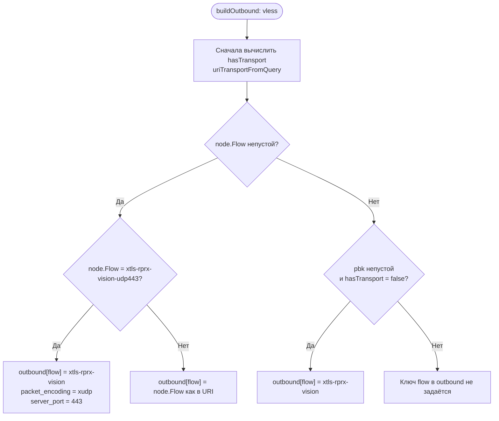
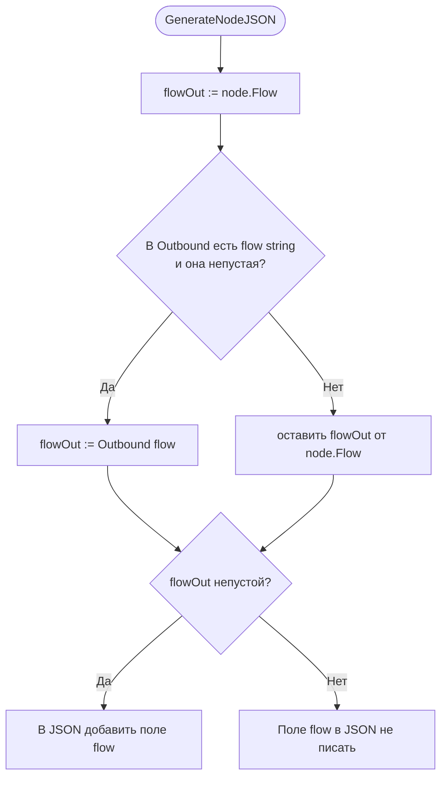

# Исследование: поле `flow` у VLESS outbound в sing-box

## 1. Цель

Зафиксировать **фактическое** поведение sing-box и библиотеки `sing-vmess` относительно поля **`flow`** у исходящего VLESS, чтобы лаунчер не подставлял лишние значения и не путал «обязательность ключа в JSON» с «обязательностью Vision».

---

## 2. Вопросы, на которые отвечает спека

1. Обязано ли поле **`flow`** присутствовать в JSON-конфиге sing-box?
2. Чем отличается **отсутствие ключа** и **`"flow": ""`** при разборе конфига?
3. Какие значения **`flow`** допустимы в рантайме?
4. Когда у узла из подписки нужно **`xtls-rprx-vision`**, а когда **не** нужно подставлять Vision при пустом `flow` в URI?

---

## 3. Источники (проверено по исходникам)

Репозиторий **sing-box**, ветка по умолчанию **`testing`** (см. `default_branch` на GitHub):

- [`option/vless.go`](https://github.com/SagerNet/sing-box/blob/testing/option/vless.go) — структура `VLESSOutboundOptions`.

Репозиторий **sing-vmess** (зависимость sing-box для клиента VLESS):

- пакет `vless`, функция **`NewClient(userId, flow, logger)`** — валидация `flow`.

Официальная документация:

- [VLESS outbound](https://sing-box.sagernet.org/configuration/outbound/vless/) — описание поля `flow` и допустимых значений в доке (в т.ч. `xtls-rprx-vision`).

---

## 4. Результаты исследования

### 4.1 Структура опций в sing-box

В `VLESSOutboundOptions` поле объявлено так:

```go
Flow string `json:"flow,omitempty"`
```

**Вывод:** при стандартном `encoding/json` **отсутствие ключа `flow` в JSON** при десериализации даёт **`Flow == ""`** — то же самое, что явное **`"flow": ""`**. Отдельного требования «ключ обязан быть в файле» в этой структуре **нет**; важно итоговое **значение** строки.

### 4.2 Проверка в sing-vmess (`NewClient`)

Упрощённо логика такая:

```text
switch flow {
case "", "xtls-rprx-vision":
    // OK
default:
    return error "unsupported flow: …"
}
```

**Вывод:**

- **`""`** — режим **без** подпротокола Vision.
- **`xtls-rprx-vision`** — режим **с** Vision.
- Любое **другое непустое** значение — **ошибка** конфигурации/инициализации клиента.

### 4.3 Документация sing-box (страница VLESS)

В разделе полей явно помечены как **Required** только `server`, `server_port`, `uuid`. У **`flow`** нет метки Required; в примере структуры конфига поле показано как часть общего шаблона, а не как «всегда заполнять Vision».

**Вывод:** документация **не** требует всегда указывать непустой `flow` для любого VLESS.

### 4.4 Протокольные ограничения (контекст)

Сочетание **Vision + WebSocket** в обсуждениях sing-box отмечали как **невалидное**. Поэтому **нельзя** при пустом `flow` в URI **вслепую** подставлять `xtls-rprx-vision` для всех узлов: для WS/gRPC/других транспортов без Vision сервер ожидает **отсутствие** Vision.

**Вывод:** подстановка **`xtls-rprx-vision`** допустима только когда это соответствует **реальному** сценарию: явный `flow` в URI (с нормализацией Xray→sing-box, см. §4.5), либо **эвристика REALITY + TCP без transport** (условия и исключения — **явно в §4.6**).

### 4.5 Нормализация `xtls-rprx-vision-udp443` в лаунчере (да, это делаем мы)

В подписках и Xray-стиле ссылок встречается **`flow=xtls-rprx-vision-udp443`**. Это **не** отдельное допустимое значение `flow` в sing-box: в **sing-vmess** `NewClient` принимает только **`""`** и **`xtls-rprx-vision`**; любое иное непустое значение даёт ошибку вида **`unsupported flow`**.

Поэтому в **`buildOutbound`** (ветка `vless` в [`node_parser.go`](../../core/config/subscription/node_parser.go)) лаунчер **явно** преобразует этот вход:

| Вход (из query URI, поле `node.Flow`) | Что попадает в `outbound` для sing-box |
|----------------------------------------|----------------------------------------|
| `xtls-rprx-vision-udp443` | `flow` → **`xtls-rprx-vision`**, плюс **`packet_encoding`** → **`xudp`**, плюс **`server_port`** → **443** (жёстко, независимо от порта в ссылке — так зафиксировано в коде для этого варианта). |
| любой другой непустой `flow` | `outbound["flow"]` копируется **как есть** из URI (если значение несовместимо с sing-box, ошибка проявится уже при запуске ядра). |

**Важно про фильтры и метаданные:** в **`ParsedNode`** поле **`Flow`** по-прежнему хранит **исходную** строку из URI (например `xtls-rprx-vision-udp443`), чтобы **skip-фильтры** подписок по полю `flow` в [`parser_config`](../../docs/ParserConfig.md) совпадали с тем, что написано в ссылке. В **JSON для sing-box** при генерации используется уже **нормализованное** значение из **`node.Outbound["flow"]`** (см. [`outbound_generator.go`](../../core/config/outbound_generator.go), блок `flow` и комментарий про udp443).

Покрытие тестами: например **`TestGenerateNodeJSON_VLESS_XtlsVisionUDP443`** в [`generator_test.go`](../../core/config/generator_test.go) и сценарии skip/конвертации в [`node_parser_test.go`](../../core/config/subscription/node_parser_test.go).

### 4.6 Эвристика лаунчера: пустой `flow` в URI + REALITY + «чистый» TCP (без transport из query)

В [`buildOutbound`](../../core/config/subscription/node_parser.go) (ветка `vless`) после обработки непустого `node.Flow` есть ветка **`else if`**, которая выставляет **`outbound["flow"] = "xtls-rprx-vision"`**, если выполняются **все** условия:

| Условие | Смысл |
|--------|--------|
| **`node.Flow` пустой** | В query параметр `flow` отсутствует или пустой — иначе сработала бы предыдущая ветка с явным `flow`. |
| **В query есть непустой `pbk`** | Признак REALITY (публичный ключ); поиск через **`queryGetFold`** (регистронезависимые ключи query). |
| **`hasTransport == false`** | Функция **`uriTransportFromQuery`** **не** построила объект `transport` (нет ws / grpc / http / httpupgrade и т.п. в смысле парсера). |

**Зачем:** в подписках ссылки на **VLESS + REALITY поверх обычного TCP** часто **не содержат** `flow=xtls-rprx-vision`, хотя сервер настроен на Vision. Без подстановки `flow` клиент sing-box остался бы без Vision и мог не совпасть с сервером.

**Когда эвристика намеренно не срабатывает:** если из query собран **transport** (например **`type=grpc`** + REALITY), то **`hasTransport == true`** — **`flow` в outbound не подставляется** (типичный пример: gRPC+REALITY **без** Vision на стороне клиента; см. тест **`abvpn-style grpc reality`** в [`node_parser_test.go`](../../core/config/subscription/node_parser_test.go)).

**Покрытие тестами:** например подтест **`REALITY TCP without flow — default xtls-rprx-vision`** в [`node_parser_test.go`](../../core/config/subscription/node_parser_test.go).

### 4.7 Все случаи: когда заполняется `flow` (явно + блок-схемы)

Сводка по текущему коду: [`node_parser.go`](../../core/config/subscription/node_parser.go) (`buildOutbound`, ветка `vless`), [`outbound_generator.go`](../../core/config/outbound_generator.go) (`GenerateNodeJSON`, шаг с `flow`).

Ниже — **два уровня**: (A) карта **`outbound["flow"]`** в **`buildOutbound`** после разбора VLESS URI; (B) попадание поля **`flow`** в **итоговый JSON** в **`GenerateNodeJSON`**.

#### A. Карта `outbound["flow"]` в `buildOutbound` (только `scheme == vless`)

Сначала всегда вычисляются **`transport`** и флаг **`hasTransport`** ([`uriTransportFromQuery`](../../core/config/subscription/node_parser_transport.go)); **`node.Flow`** — строка параметра **`flow`** из query URI (может быть пустой).

| № | Условие (в порядке проверки в коде) | `outbound["flow"]` | Дополнительно в `outbound` |
|---|-------------------------------------|-------------------|----------------------------|
| **1** | **`node.Flow != ""`** и **`node.Flow == "xtls-rprx-vision-udp443"`** | **`xtls-rprx-vision`** | **`packet_encoding` = `xudp`**, **`server_port` = `443`** |
| **2** | **`node.Flow != ""`** и значение **любое другое** | **то же строковое значение, что в URI** | без доп. правок из этой ветки |
| **3** | **`node.Flow == ""`** и **`pbk`** (query, через `queryGetFold`) **не пустой** и **`hasTransport == false`** | **`xtls-rprx-vision`** | только `flow` из этой ветки |
| **4** | **`node.Flow == ""`** и **не** выполнены условия строки 3 (нет `pbk` **или** есть transport из query) | **ключ `flow` в `outbound` не создаётся** | — |

**Замечание:** случаи **1–2** взаимоисключающие с **3–4**: при непустом `node.Flow` ветка с `pbk` **не** выполняется (она в `else if`).

#### Блок-схема A: `buildOutbound`, ветка VLESS



#### B. Поле `flow` в JSON (`GenerateNodeJSON`)

Итоговая строка для JSON:

1. Берётся **`node.Flow`**.
2. Если в **`node.Outbound`** есть ключ **`flow`** типа string **и** значение **непустое**, оно **подменяет** шаг 1 (чтобы в конфиг не утек `xtls-rprx-vision-udp443`, а уходило уже **`xtls-rprx-vision`** из `outbound`).
3. Если после слияния строка **непустая** — в JSON добавляется **`"flow": "<значение>"`**. Если **пустая** — **поле `flow` в объект не пишется** (для sing-box это «без Vision»).

| № | После слияния `flowOut` | Поле в JSON |
|---|-------------------------|-------------|
| **B1** | непустое (например из `Outbound["flow"]` после случая A1/A2/A3) | есть **`"flow"`** |
| **B2** | пустое (случай A4 и нет иного источника) | **нет** ключа `flow` |

#### Блок-схема B: `GenerateNodeJSON` и `flow`



---

## 5. Требования к лаунчеру (критерии)

1. В сгенерированном JSON для sing-box поле **`flow`** выводить **только при непустом** значении, либо оставлять поведение эквивалентным **отсутствию ключа** (т.е. не требовать явного `"flow": ""` ради ядра sing-box).
2. **`xtls-rprx-vision`** выставлять только там, где зафиксирована логика Vision: непустой `flow` в URI (и udp443 → §4.5) **или** эвристика из **§4.6** (пустой `flow` + `pbk` + нет transport из query).
3. Для узлов **без** Vision (в т.ч. gRPC+REALITY без vision на сервере) **не** добавлять ключ `flow` с пустой строкой **только из соображений совместимости с sing-box** — это не требование ядра; явный `""` имеет смысл только если внешний валидатор конфига требует наличие ключа (отдельная политика).

---

## 6. Связь с кодом репозитория

| Место | Роль |
|--------|------|
| [`core/config/subscription/node_parser.go`](../../core/config/subscription/node_parser.go) — `buildOutbound`, ветка `vless` | Все ветки **`outbound["flow"]`** — сводная таблица и схема **§4.7 (A)**; детали udp443 — **§4.5**, REALITY+TCP — **§4.6**. |
| [`core/config/outbound_generator.go`](../../core/config/outbound_generator.go) — `GenerateNodeJSON`, блок `flow` | Слияние `Outbound["flow"]` и `node.Flow`, печать только при непустом итоге — **§4.7 (B)**. |

---

## 7. Статус

Исследование **завершено**; выводы согласованы с откатом эксперимента «всегда писать `flow: ""`» (см. **IMPLEMENTATION_REPORT.md**).
